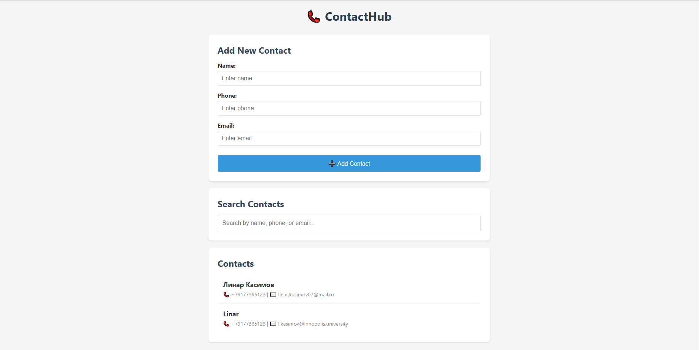

# ContactHub

A web-based phone book application for storing, searching, and managing personal contacts with secure user authentication.

## Demo



*Register, login, and manage your personal contacts securely*

## Product Context

**End user:** All people who need to store and manage contacts in one place

**Problem:** Contacts are scattered across different services (phone, social media, messengers), making it difficult to find and manage them centrally

**Your solution:** A secure web application where users can register, login, and manage their personal contacts with authentication.

## Features

### Version 1 (Lab Demo)
- ✅ Add new contact (name, phone, email)
- ✅ Search existing contacts by name, phone, or email
- ✅ Clean and responsive web UI
- ✅ Real-time search as you type

### Version 2 (Deployed)
- ✅ User authentication — Register and login to your personal account
- ✅ Personal contact lists — Each user has their own isolated contacts
- ✅ Secure password storage — Passwords are hashed
- ✅ Docker containerization
- ✅ Persistent data storage
- ✅ Deployment-ready for any VM
- ✅ Full documentation

## Usage

### Quick Start (Docker)

```bash
# Clone the repository
git clone https://github.com/l1n0n/se-toolkit-hackathon.git
cd se-toolkit-hackathon

# Start the application
docker-compose up -d

# Open in browser
# http://localhost:8000
```

### How to Use

1. **Register a new account:**
   - Click the "Register" tab on the login page
   - Enter a username and password
   - Click "Register" to create your account

2. **Login to your account:**
   - Enter your username and password
   - Click "Login" to access your personal contacts

3. **Add a contact:**
   - Fill in the name, phone, and email fields
   - Click "Add Contact" button
   - Contact appears in the list below

4. **Search contacts:**
   - Type in the search box
   - Results filter automatically as you type
   - Searches across name, phone, and email fields

5. **Logout:**
   - Click the "Logout" button in the header to exit your account

## Deployment

### Deploy with Docker (Recommended)

**Requirements:**
- Docker
- Docker Compose

**Instructions:**

```bash
# Clone the repository
git clone https://github.com/l1n0n/se-toolkit-hackathon.git
cd se-toolkit-hackathon

# Build and run
docker-compose up --build -d

# Open in browser
# http://localhost:8000
```

### Deploy to VM (Ubuntu 24.04)

**Instructions:**

```bash
# Install Docker
curl -fsSL https://get.docker.com -o get-docker.sh
sudo sh get-docker.sh

# Clone and deploy
git clone https://github.com/l1n0n/se-toolkit-hackathon.git
cd se-toolkit-hackathon
docker-compose up -d

# Access at http://your-vm-ip:8000
```

### Manage Application

```bash
# View logs
docker-compose logs

# Stop application
docker-compose down

# Restart application
docker-compose restart
```
